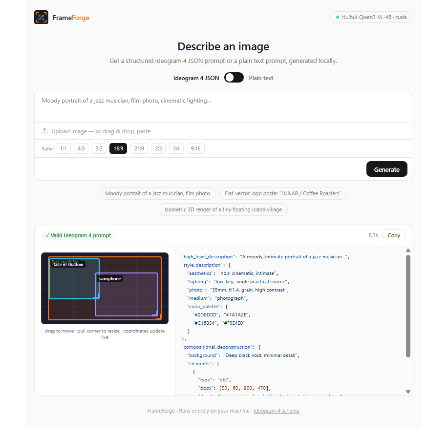

# Ideogram4 Dataset Editor

Dataset editor for Ideogram 4 prompts. Runs as a **Windows Portable App** — no installer, no Pinokio, no admin rights.

Left: 3-column grid of every image in a folder. Right: editor for the generated prompt (Ideogram 4 JSON / Plain text / MiniMax H3), with interactive bbox canvas.



Dataset editor for Ideogram 4 — portable, no install required.

---

## What it does

- **Folder → grid**: paste a Windows path like `C:\Datasets\my-images` and every `.jpg/.png/.webp/.bmp/.gif` appears in a 3-column grid on the left.
- **Caption sidecars**: each image can have a sidecar prompt next to it — `.json` for Ideogram 4 structured prompts, `.txt` for plain/MiniMax. Green badge = has caption, grey = missing.
- **Prompt generation** (optional, local): uses a local vision-language model (Huihui-Qwen3-VL-4B via `llama-server` CUDA 12.4) with grammar-constrained JSON, normalization, and AJV validation.
- **Editor on the right**: click an image → its prompt loadseditable. Save writes the sidecar file in place, Copy copies to clipboard, Generate creates a new prompt from the image. Ideogram mode includes the drag-to-move / resize bbox canvas.
- **No install**: extract the folder, double-click `run.bat`. If Node.js is on PATH it just works; otherwise drop a portable `node.exe` at `app\node\node.exe` and it still works offline. Generation works even without a model — you can still browse and edit existing captions.

---

## Quick start (portable)

### Option A — System Node.js (easiest)

1. Install Node.js 20+ from https://nodejs.org (or use a portable build).
2. Extract the zip anywhere (e.g. `D:\Tools\Ideogram_Dataset_Editor`).
3. Double-click **`run.bat`** in the root.
4. A console opens and the browser launches at http://127.0.0.1:8123.
5. Keep the console open while you work — close it to quit. Run `update.bat` anytime to `git pull` + refresh dependencies.

### Option B — Fully portable (no system install)

1. Download Node.js **win-x64 zip** from https://nodejs.org/dist/latest-v20.x/ (e.g. `node-v20.19.0-win-x64.zip`).
2. Extract it, copy `node.exe` to `app\node\node.exe` (create the `app\node` folder).
3. Also copy the `npm` folder if you want first-run `npm install` to work offline — otherwise run `npm install` once on a machine with internet, then the `node_modules` folder travels with the app.
4. Double-click `run.bat` — no system install touched.

> The app will run `npm install` automatically on first launch if `node_modules` is missing. After that the folder is self-contained and can be moved/copied to another Windows PC and launched offline.

### Enabling AI generation (optional)

Dataset browsing/editing works without any model. To enable Generate:

```bat
cd app
npm install
node scripts/download-llama.mjs        :: downloads llama-server CUDA build to app\bin\
```

Then download the model files into `app\models\`:

```bat
:: using huggingface_hub (pip install huggingface_hub)
hf download noctrex/Huihui-Qwen3-VL-4B-Instruct-abliterated-GGUF Huihui-Qwen3-VL-4B-Instruct-abliterated-Q4_K_M.gguf --local-dir models
hf download noctrex/Huihui-Qwen3-VL-4B-Instruct-abliterated-GGUF mmproj-F16.gguf --local-dir models
:: or download manually from https://huggingface.co/noctrex/Huihui-Qwen3-VL-4B-Instruct-abliterated-GGUF
```

Restart the app — health badge shows model name and `· ready`.

---

## How to use

1. **Load a folder**: paste an absolute path like `C:\Datasets\my-images` into the top bar and click **Load** (or click **Browse** and pick a folder — a local preview is shown; for Save to write files on disk, use the path input).
2. **Browse grid**: all images appear 3 per row. Green badge = caption exists.
3. **Edit**: click an image → preview + prompt loads on the right. Edit the text, then **Save** (writes `.json` or `.txt` next to the image, validated in Ideogram mode). **Copy** copies, **Delete caption** removes the sidecar.
4. **Generate**: select an image, optionally type steering in the bar (e.g. `warm amber tones, film photography feel`), choose mode/aspect ratio, click **Generate**. Streams into the editor — Save when happy. **Generate missing** batch-generates for every image lacking a caption.
5. **Bbox editor** (Ideogram JSON only): canvas shows each element's box. Drag to move, pull corner to resize, × to delete, palette swatches to edit colors, description field inline — JSON updates live.

### Modes

- **Ideogram 4 JSON** → sidecar `.json`, strict schema, bbox canvas.
- **Plain text** → sidecar `.txt`, Flux/SDXL style prompt.
- **MiniMax H3 (ComfyUI)** → sidecar `.txt`, video prompt format.

### Aspect ratios

1:1, 4:3, 3:2, 16:9, 21:9, 2:3, 3:4, 9:16 — informs generation and canvas shape.

---

## Portable details

- **No install, no Pinokio** — just `run.bat` to start and `update.bat` to `git pull`.
- **No registry, no admin**: all files stay inside the extracted folder. `app\models\`, `app\bin\`, `app\node_modules\` travel with it.
- **To move PCs**: zip the whole folder and unzip on the target. Double-click `run.bat`.
- **Port**: default `8123` (`PORT` env var overrides). Internal llama-server on `8124` (`LLAMA_PORT`).

---

## API (portable server)

`http://127.0.0.1:8123`

| Method | Path | Description |
|--------|------|-------------|
| `GET` | `/` | Dataset editor UI |
| `GET` | `/api/health` | `{status, model, mmproj, vision, generation}` |
| `GET` | `/api/schema` | Ideogram 4 JSON Schema |
| `POST` | `/api/list` | `{"folderPath":"C:\\path"}` → `{folder, count, images:[{file,size,captionFile}]}` |
| `GET` | `/api/image?path=C:\path\img.jpg` | Serves image file |
| `GET` | `/api/caption?path=C:\path\img.jpg` | `{exists, content, mode, file}` — sibling .json/.txt |
| `POST` | `/api/save-caption` | `{"imagePath":"...","content":"...","mode":"ideogram\|plain"}` — validates JSON if ideogram |
| `POST` | `/api/delete-caption` | `{"imagePath":"..."}` |
| `POST` | `/api/generate` | `{"description","image":"data:...;base64,","mode","aspectRatio","steering"}` — streams NDJSON |
| `POST` | `/api/generate-folder` | `{"folderPath","mode","aspectRatio","steering"}` — batch, streams `file-start/done/error` |

Streamed `done` for ideogram includes `{prompt, prompt_compact, valid, duration_ms}`.

---

## Project layout

```
Ideogram_Dataset_Editor/   ← root (portable app)
├── run.bat                ← double-click to start (portable launcher)
├── update.bat             ← git pull + npm install
├── app/
│   ├── server.mjs          ← HTTP server + generation + dataset APIs
│   ├── public/index.html   ← 3-col grid + editor UI (no chat)
│   ├── scripts/download-llama.mjs
│   ├── src/ (ideogram-schema, generation-schema, normalize, validate, prompt)
│   ├── bin/                ← llama-server.exe (downloaded)
│   ├── models/             ← GGUFs (downloaded)
│   └── node/               ← optional portable node.exe
└── README.md
```

## Configuration env vars (read by `app/server.mjs`)

| Variable | Default | Description |
|----------|---------|-------------|
| `PORT` | `8123` | UI port |
| `LLAMA_PORT` | `8124` | Internal llama-server port |
| `MODEL_PATH` | first `.gguf` in `app/models/` | Override model |
| `MMPROJ_PATH` | first `mmproj*.gguf` in `app/models/` | Vision projector |
| `CONTEXT_SIZE` | `32768` | Context window |

---

## Notes

- Runs entirely locally — no cloud, no install.
